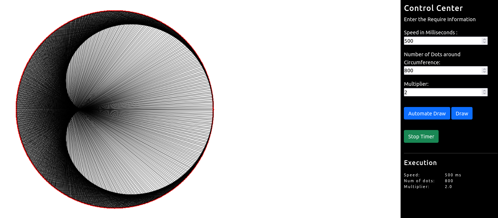
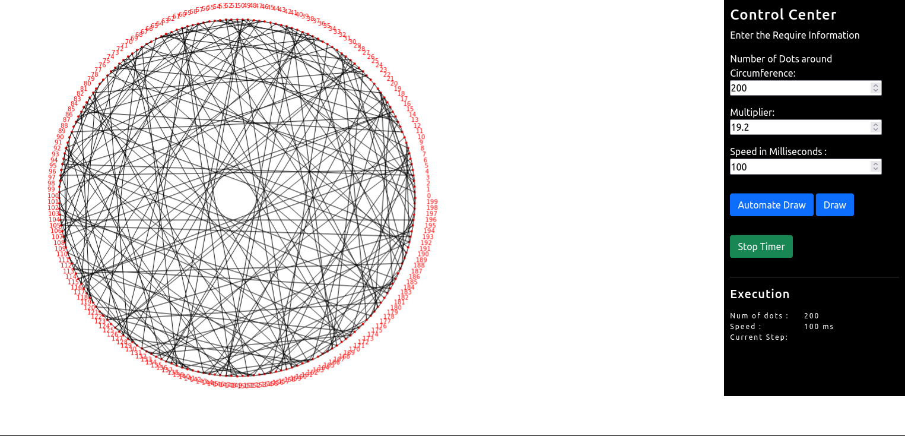
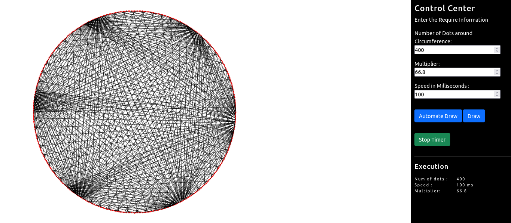

## Fractal Simulation 

This is my personal challenge which inspired by "Times Tables, Mandelbrot and the Heart of Mathematics" by Mathologer tutorial. I watched his tutorials multiple times and tried to understand. 

*** This project started from scratch. 

I challenge myself by using JavaScript and CSS and HTML-5. The JavaScript will draw simulation on HTML-5 Canvas. There were a lot challenging to 
understand the basic geometry and applying its knowledge on real life which was hard. 

During my development, I needed to go back and watch the tutorial again and again to verify my code. 

<strong>Project Estimate Duration:</strong>
 

1st: 12:00 Hours  
2st: 16:00 Hours (*** including bug fixes)

Total: Around <strong>28 Hours</strong> 
 
Project Finished <strong>May 16, 2022 04:00pm</strong>
 

#### Sample Screenshots

 

 

 

### How to Run Project: 
<ol>
<li>Open the file called <strong>"FractalSimulation.html"</strong> on your favorite browser (such as FireFox, Chorome or Edge). No webserver required. </li>

 

<li>
<strong>To make a custom drawing, enter the info as follow: </strong>
<ol>
    <li>Number of Dots around Circumference: 200</li>
    <li>Multiplier: 200</li>
    <li>Click "Draw" button</li>
</ol>
</li>

<li>
Or, <strong>to automate drawing:</strong>
<ol>
    <li>Number of Dots around Circumference: 200</li>
    <li>Multiplier: 200</li>
    <li>Speed in Milliseconds: 250</li>
    <li>Click "Automate Draw" button</li>
</ol>
</li>

<li>
Or
<ol>
    <li>Just Click <strong>"Automate Draw"</strong> button which will set all the require values for you.</li>
</ol>
</li>

<li>
Click <strong>"Stop Timer"</strong> button to stop the timer. Then you can redraw it again.
</li>

</ol>

#### Reconmmand to watch YouTube channel 
https://www.youtube.com/watch?v=qhbuKbxJsk8 "MathBloger Youtube Channel

#### Most of the Drawing the dots around the circle is inherited from StackOverflow sites: 
Ref: https://stackoverflow.com/questions/32681610/drawing-point-on-circle
    

### LICENSE (Apache 2 or Later)
You may use this code in your personal, commercial, educational projects with free of charge, however, 
if you have used any of the code from my source code either in whole or partial, you must include My Github's USER NAME and Source Code links on both in source code and at frontend pages. 

I include some of the source code from StackOverFlow website. YOU ARE REQUIRED TO CHECK ITS TERMS AND POLICIES BEFORE YOU PUBLISH. 

SOFTWARE IS NOT GUARANTEE AND AS IS. YOU MAY FIND BUGS AND OTHER COMPUTATIONAL ISSUES. 