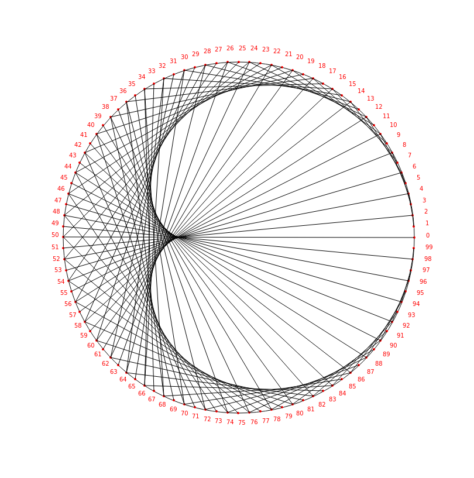

## Fractal Simulation 

This is my personal challenge which inspired by "Times Tables, Mandelbrot and the Heart of Mathematics" by Mathloger tutorial. I watched his tutorials multiple times and tried to understand. 

I challenge myself by using JavaScript on HTML-5 Canvas. There are a lot challenging to 
understand the basic geometry and applying its knowledge on real life which is hard. 

During my development, I need to go back and watch the tutorial again and again to verify my code. 

Project Estimate Duration: 
1st: 12:00 Hours  

#### Reconmmand to watch YouTube channel 

#### Most of the Drawing the dots around the circle is inherited from StackOverflow sites: 
Ref: https://stackoverflow.com/questions/32681610/drawing-point-on-circle
    

